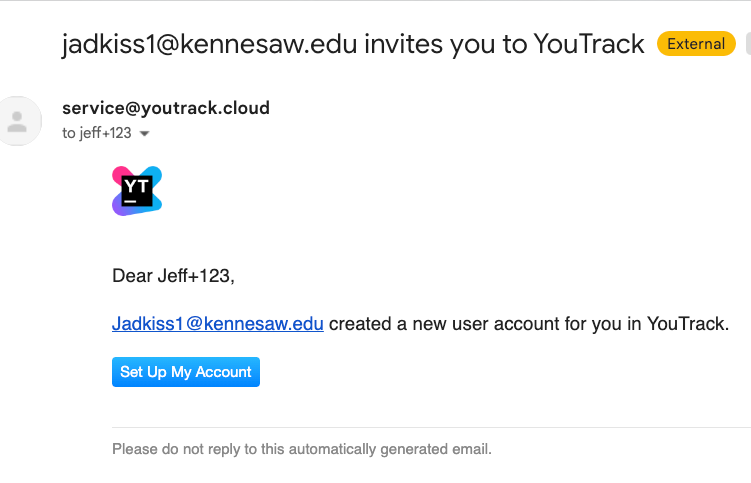
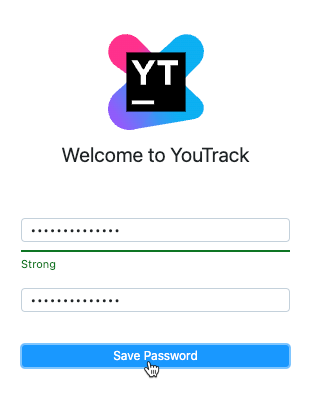
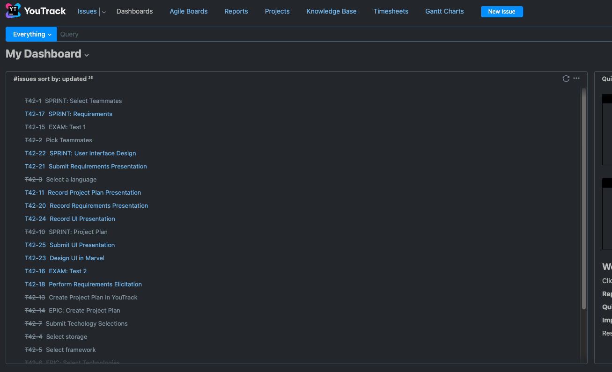
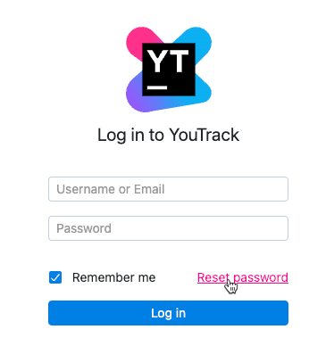
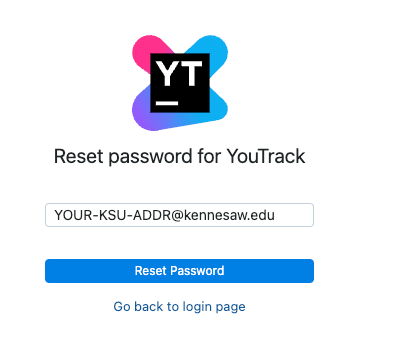
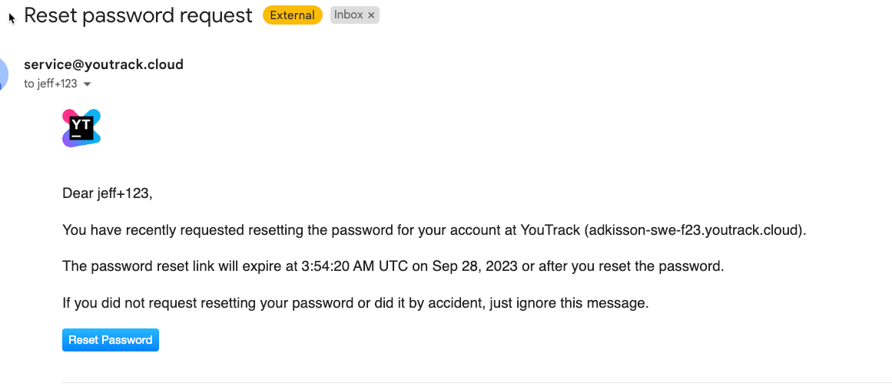
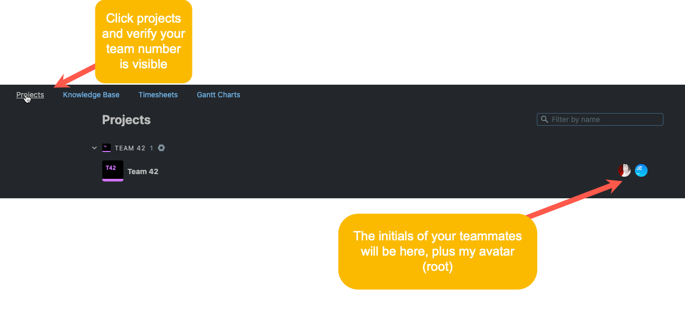

[< Back to Project Overview](README.md#project-plan)

# Project Plan Submission and Rubric

## Deliverables

All deliverables will be in your team Github repo or YouTrack.

All deliverable documentation will be written in [Markdown](https://www.markdownguide.org/getting-started/). Your Gantt chart will be produced in [YouTrack](https://www.jetbrains.com/youtrack/). Your presentation will be produced in whatever video recording software you prefer.

Your deliverables for this component include:

1.  Introduction (Github/Markdown)
2.  Team resumes (Github/Markdown)
3.  Team assignments (Github/Markdown)
4.  Technology selection (Github/Markdown)
5.  Project plan milestones, epics and stories and Gantt chart (YouTrack)
6.  3-5 minute recorded video presentation describing your plan, technology selection and team assignments (post to Github)

### Access to YouTrack

Each student has a license and team assignment in YouTrack.

#### To register to use YouTrack:

1.  Find the invitation you received to join YouTrack in your KSU inbox sent on Wed Sept 27.
2.  Click on the registration link.
    

3.  Enter a strong password:
    

4.  You will see your team's dashboard:
    

#### To login to YouTrack

1.  Go to https://adkisson-swe-f23.youtrack.cloud
2.  Login with your KSU email address and password you set during your first visit to YouTrack.

#### I Forgot My YouTrack Password

1.  Go to https://adkisson-swe-f23.youtrack.cloud
2.  Click **Reset password**
    
3.  Enter your KSU email address:
    
4.  Check your email and click the **Reset Password** link.
    

### DO NOT WAIT TO LOGIN TO YOUTRACK

Do not find out your YouTrack account is not configured properly at the last minute.

Login to YouTrack immediately. Remember your password.

If you have trouble after following these instructions carefully, send me an email with a detailed description of your problem.

You also need to verify with each of your teammates that they can login and have access to the same team you are on.

If you think I made a mistake (it's possible), email me as soon as possible. I will not be fixing things at the last minute.

After you login the first time, click the Projects link and verify your team is present:

### Access to JetBrains IDEs

Each student has a license to all JetBrains products via an educational license.

You can also just get your own via https://sales.jetbrains.com/hc/en-gb/articles/207241195-Do-you-offer-free-educational-licenses-for-students-and-teachers-. All you need is a .EDU address.

To use the license I have provided you:

1.  Install a JetBrains IDE such as Rider (C#), IntelliJ (Java), etc.
2.  From the license screen, select **License server**, then paste `https://ksu-adkisson.fls.jetbrains.com/` into the **Server address** field.
3.  Finally, click **Activate**.
4.  You will be redirected to a browser window where you will have to create a JetBrains education account. You *must* use your `@Kennesaw.edu` email address to use the licenses I have provided. A personal address will not work.

These are free licenses. If you have trouble using them, I cannot offer you technical support.

If you have problems using the classroom-provided IDE licenses, just get an education license of your own. https://sales.jetbrains.com/hc/en-gb/articles/207241195-Do-you-offer-free-educational-licenses-for-students-and-teachers-. I used these licenses all through graduate school.

## Requirements

1.  [Very carefully read the Project Plan section in the main README file.](README.md#project-plan) 
    I recommend printing it and carefully highlighting/commenting everything in that section. It is very detailed and I have high expectations for each team.
2.  Check all documentation into your team Github repo. Make sure all documentation is linked, organized, spell checked, and grammatically correct.
3.  Check your video presentation into your team Github repo. Create a folder called "presentations". Name the presentation "1-project-plan-presentation.[extension]" [Free Github accounts do not allow massive files](https://docs.github.com/en/repositories/working-with-files/managing-large-files/about-large-files-on-github), so be sure to compress your presentation a bit (not zipped [which won't help anyway] - [just shrink it to a smaller size where it's still high-resolution](https://multimedia.easeus.com/video-converter-tips/compress-video-vlc.html). Large files like video can be made to fit on Github easily, so be ready for this bit of effort if the original file is too big to check in without a bit of compression.
4.  Prove you can follow my instructions. Engineering is a very precise art. Some things we design, other things we follow. Here you are designing your project plan and carefully following my requirements to execute and submit the work.

### Submission Steps

The entire team will work execute the project plan requirements. *All of you need* to review the completed work. This is a team effort and the team will succeed or fail as a group.

Once your work is complete, ***every* team member will do the following:** post a link to your team's Github repo in the Project Plan assignment in D2L before 11:59PM on Thursday, October 12, 2023.

If you forget to post your link in D2L, you will receive a late submission penalty (see syllabus). Do not rely on your teammates for this. Everyone must submit the link themselves (it's connected to the gradebook).

### Grading Rubric

#### Component Percentages

1.  Introduction (Github) - 10%
2.  Team resumes and assignments (Github) - 15%
3.  Technology selection (Github) - 15%
4.  Project plan Gantt chart (YouTrack) - 40%
5.  3-5 minute video presentation describing your plan, technology selection and team assignments (Github) - 20%

#### Written Scoring (40% total)

-  90 to 100%: meets all requirements, well-written well organized, and highly professional. Polished work gets the top grade.
-  80% to 89%: meets all requirements, may have some writing or organizational issues.
-  70% to 79%: meets most requirements, may have some writing or organizational issues.
-  69% or below: does not meet most requirements or is very poorly written.

*Note: Written work not posted to Github using Markdown will not be graded.*

#### Project Plan Scoring (40% total)

-  90% to 100%: meets all requirements, well-organized, clearly laid out and easy to see project plan chart end-to-end. Polished work gets the top grade.
-  80% to 89%: meets all requirements, may have some organization or layout issues.
-  70% to 79%: meets most requirements, may have some writing or organization issues.
-  69% or below: does not meet most requirements or has significant organization issues.

*Note: Project Plans not performed in YouTrack will not be graded.*

### Presentation Scoring (20% total)

-  90% to 100%: meets all requirements, well-organized, easy to follow audio. Polished work gets the top grade.
-  80% to 89%: meets all requirements, easy to follow audio, may have some organization issues.
-  70% to 79%: meets most requirements, may have some organization or audio issues.
-  69% or below: does not meet most requirements or has little or no audio.

*Note: Presentations not posted to Github will not be graded.*

### Academic Honesty

Your work must be your own. Do not plagiarize under any circumstances. All work is subject to review by TurnItIn, etc.

More importantly, this course is a waste of your time if you do not do the work yourself. If you are tempted to cheat, you need to ask yourself why you are here and what you hope to accomplish in your career if you get the grade, but have minimal ability to perform the work after you leave the University.

### Team Grading

Everyone on the team will receive the same grade one exception. It follows.

Anyone not participating in the project may be removed from the team and have to perform the project alone. Before anyone can be "fired" from a team, I must meet with the *entire team* and hear what is happening. Do not fire anyone from your team without my explicit prior agreement.

---

[< Back to Project Overview](README.md#project-plan)

