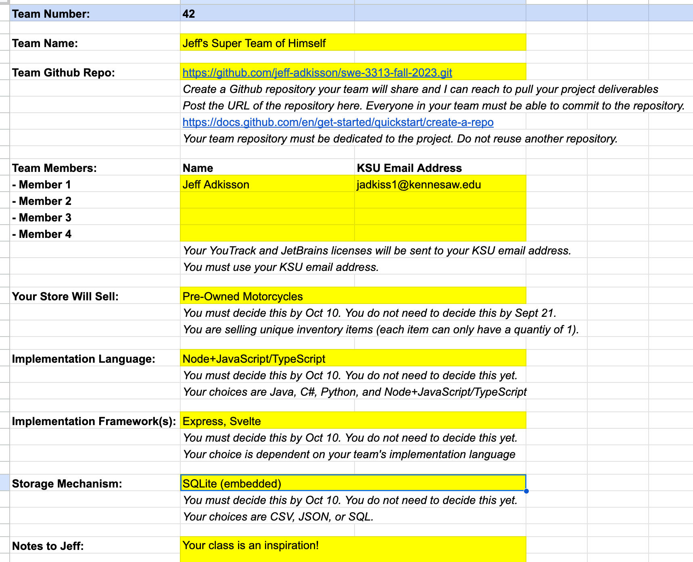

[< Back to Project Overview](README.md#team-selection)

# Team Selection Instructions and Rubric

1. Read the [Team Selection Overview](README.md#team-selection) in the [Project Introduction](README.md) document.
1. Put together your team. 
3. Post your team information on this [Google Spreadsheet](https://docs.google.com/spreadsheets/d/1HAYA4j73sbCi0KeXlEjSr-4Po-mB3QXsVpAHA1ZZQbQ/edit?usp=sharing). Read the Instructions tab, then select an unused team sheet and complete the required information. Do not modify the spreadsheet or change another team's information. 
   - You must complete the Name, Github Repo, and Team Members rows by the assigned date.
   - You must complete the Implementation and Storage rows by the date the [Project Plan](README.md#project-plan) is due.

## Grading Rubric

Team selection is not graded.

- Choose your team wisely.
- Complete the team roster spreadsheet on time.

---

[< Back to Project Overview](README.md#team-selection)

